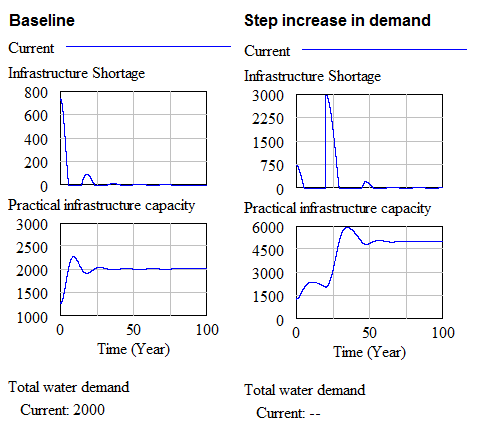

# Infrastructure System

This document describes the infrastructure system part of the kirkwood water crisis system. 

**Figure 1: Infrastructure system diagram**

## System description
The infrastructure system describes the commissioning, decommissioning and maintenance of the water supply system in the Kirkwood area. **Theoretical Infrastructure Capacity** is the theoretical maximum the water infrastructure can supply without leakage or pushing it over capacity. The average lifetime of infrastructure is 30 years after which it becomes Aged Infrastructure and no longer adds to the water supply capacity. The infrastructure lifetime can be influenced by several factors such as the *percentage infrastructure maintained annually* and how much the infrastructure is pushed over its capacity, which is depicted in the system as the *effect on infrastructure pushing on ageing time*.

Due to *Leakages* the theoretical capacity will not always be reached. Leakages are set to decrease the theoretical capacity by 30% and the resulting capacity is captured in the *practical infrastructure capacity*. This capacity is then used together with the *total water demand* coming from the population system to  determine the *infrastructure shortage*. 

The *planning of new infrastructure* is done based on the *infrastructure shortage*, *infrastructure surplus* and the *ageing infrastructure*. Infrastructure becomes planned in a period of 1/10th of a year (*infrastructure planning time*). Planned infrastructure gets build in 5 years (*Infrastructure building time*) and is constrained  by the available staff for building infrastructure (*Available building capacity by staff*) and the available funds for building infrastructure (*Available building capacity by funds*).

## Assumptions
Several assumptions needed to be made due to gaps in the background reading. These assumptions are described in this section.

### Effect of maintenance on aging time:
In the background reading it was described that at 8% maintenance per year the average aging time of infrastructure is 30 years. We assumed that when there is 0% maintained per year, the average aging time will become 15 years.

### Effect of capacity pushing on aging time:
The background reading described that pushing the infrastructure can drastically decrease the lifespan of infrastructure. We assumed that at the maximum pushing of infrastructure of 30% the lifespan of infrastructure is decreased by 10 years.

## Interface description
This section will describe the variables this system needs from other subsystems and the variables this system provides which can be used by other subsystems.

| Variable Name  | Description           | Unit  |
| -------------	 |:------------- 		| -----:|
| **Incoming**   | 						|  |
| Water demand   | The total water demand of all users from population system  | *ML/year*  |
| Available maintenance capacity by staff  | The amount of infrastructure which can be maintained limited by staff      		|  *ML/year*  |
| Available maintenance capacity by funds  | The amount of infrastructure which can be maintained limited by funds      		| *ML/year*  |
| Available building capacity by staff  | The amount of infrastructure which can be built limited by staff      		|  *ML/year*  |
| Available building capacity by funds  | The amount of infrastructure which can be built limited by funds      		|  *ML/year*  |
| Available staff capacity for planning infrastructure  | The amount of infrastructure which can be planned limited by staff      		|  *ML/year*  |
| **Outgoing**	 |   		|    |
| Theoretical infrastructure capacity  | The capacity of built infrastructure without leaks    		| *ML/year*   |
| Maximum infrastructure capacity  | The maximum water which can be supplied to users including pushing the infrastructure capacity    		| *ML/year*   |
| Production rate required for primary staff activities  | The amount of maintenance work for staff members    		| *ML/year*   |
| Production rate required for secondary staff activities  | The amount of planning and building work for staff members    		| *ML/year*   |

## Validation
When the system is not constrained by funds or staff constraints it is expected that the practical infrastructure capacity will meet the total water demand relatively easy and smooth.

**Figure 2: Baseline system behaviour**

Even when varying the various parameters of the system such as the building and planning times and water demand we expect to see similar behaviour as shown in figure 3.

**Figure 3: Sensitivity analysis on  building times and water demand**

When performing extreme values testing on the variables constraining the building and maintaining of the infrastructure we expect to see that in the non restricted cases the infrastructure shortage gets solved smooth and easy. However, when heavily constrained we expect the shortage not to be solved and instead remain on a constant level over time. This is shown in figure 4.

**Figure 3: Extreme value analysis on constraining variables**

