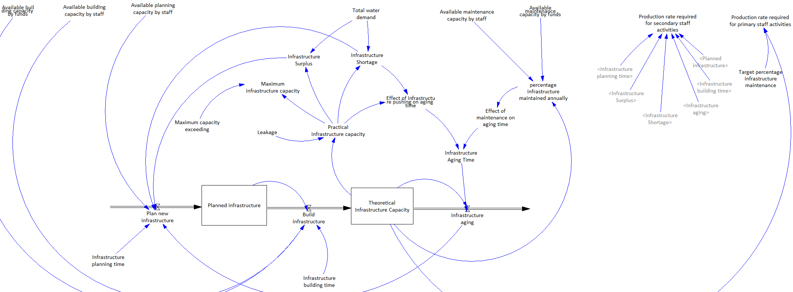

# Infrastructure System

This document describes the infrastructure system part of the kirkwood water crisis system. 

## System description
The infrastructure system describes the comissioning, decomissioning and maintenance of the water supply system in the kirkwood area. **Theoretical Infrastructure Capacity** is the theoretical maximum the water infrastructure can supply without leakage or pushing it over capacity. The average lifetime of infrastructure is 30 years after which it becomes Aged Infrastructure and no longer adds to the water supply capacity. The infrastructure lifetime can be influenced by several factors such as the *percentage infrastructure maintained annually* and how much the infrastructure is pushed over its capacity, which is depicted in the system as the *effect on infrastructure pushing on aging time*.

Due to *Leakages* the theoretical capacity will not always be reached. Leakages are set to decrease the theoretical capacity by 30% and the resulting capacity is captured in the *practical infrastructure capacity*. This capacity is then used together with the *total water demand* coming from the population system to  determine the *infrastructure shortage*. 

The *planning of new infrastructure* is done based on the *infrastructure shortage*, *infrastructure surplus* and the *aging infrastructure*. Infrastructure becomes planned in a period of 1/10th of a year (*infrastructure planning time*). Planned infrastructure gets build in 5 years (*Infrastructure building time*) and is constrained  by the available staff for building infrastructure (*Available building capacity by staff*) and the available funds for building infrastructure (*Available building capacity by funds*).

## Interface description
This section will describe the variables this system needs from other subsystems and the variables this system provides which can be used by other subsystems.

| Variable Name  | Description           | Unit  |
| -------------	 |:------------- 		| -----:|
| **Incoming**   | 						|  |
| Water demand   | The total water demand of all users from population system  | *ML/year*  |
| Available maintenance capacity by staff  | The amount of infrastructure which can be maintained limited by staff      		|  *ML/year*  |
| Available maintenance capacity by funds  | The amount of infrastructure which can be maintained limited by funds      		| *ML/year*  |
| Available building capacity by staff  | The amount of infrastructure which can be built limited by staff      		|  *ML/year*  |
| Available building capacity by funds  | The amount of infrastructure which can be built limited by funds      		|  *ML/year*  |
| Available staff capacity for planning infrastructure  | The amount of infrastructure which can be planned limited by staff      		|  *ML/year*  |
| **Outgoing**	 |   		|    |
| Theoretical infrastructure capacity  | The capacity of built infrastructure without leaks    		| *ML/year*   |
| Maximum infrastructure capacity  | The maximum water which can be supplied to users including pushing the infrastructure capacity    		| *ML/year*   |

## Validation