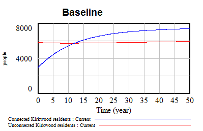

# Population system

## Population
When modeling this part of the system, only the information provided to us via Blackboard has been used.

The population system is divided in **LSRV residents excluding Kirkwood**, **Connected Kirkwood residents**, and **Unconnected Kirkwood residents**. We chose to divide the population in these groups so that we would be able to see the population shift from connected to unconnected and the other way around as well as to see how the LSRV population would change over time. The LRSV population stock excludes Kirkwood residents, although it does include Kirkwood residents in the real system, so that immigration and population growth does not overlap in the model. 

The population model includes *population growth*, *immigration* and *emigration rates*. The *population growth* of 1,2% is modeled as a flow into all three population stocks. The same is done for the *emigration rate* of 1%, which is modeled as a flow out of the three stocks. We have chosen to model the *emigration flows* so that they exit the system to represent the people that would exit the system in reality, either by actual emigration to areas outside of the LSRV area as well as by death.

An *immigration flow* is located between the **LSRV residents excluding Kirkwood** towards the **connected Kirkwood residents**, which equals 1.5%. We have assumed all immigration into Kirkwood comes from the LSRV area and since the *immigration flow* from LSRV into Kirkwood is higher than the *population growth* of 1.2% of the LSRV area, the area's population will decline over time. 

We now move on to the flows between the **connected Kirkwood residents** and the **unconnected Kirkwood residents**. One of these flows represents the *Kirkwood residents moving to unconnected households*. This *moving rate* equals 3% of the total Kirkwood population (both unconnected and connected residents). When modeling this flow, several modeling options were available. For example, the *moving rate* of 3% could either be taken of the entire Kirkwood population or only of the connected Kirkwood residents. Furthermore, this *moving rate to unconnected households* could be related to the immigrating population from the surrounding LRSV area to Kirkwood, meaning the 3% *moving rate* should be taken of the *immigration flow* and not of the people already living in Kirkwood.
The second flow represents the *unconnected Kirkwood residents getting connected to the service network*, which moves them to the **connected Kirkwood residents**. This *service network connecting rate* equals 8% of the **unconnected Kirkwood residents**.

There seems to be a discrepancy between various population numbers. In the first paragraph it is mentioned that the population of Kirkwood is 10.000 people. However, it's also mentioned there are 700 connected households and 1500 unconnected households. With a average household size of 3,9 this results in a total population of Kirkwood of 8,580 inhabitants. We have chosen to scale the number of connected and unconnected households (together 8,580 residents) to the 10.000 inhabitants mentioned in the first paragraph. This gives a total population in Kirkwood of 10.000 inhabitants, a population of the **surrounding LSRV area (excluding Kirkwood)** of 40.000 inhabitants, 3.182 **connected Kirkwood residents** and 6.818 **unconnected Kirkwood residents**. These numbers have been used as initial values for the stocks in the system.

## Water demand

The water demand is different for **connected households**, **unconnected households** and **other urban users**. Using the number of *residents per household* (3.9) the number of *connected and unconnected households* has been determined. By multiplying these variables with the water demand for both groups (347 kl/year for a connected household and 180 kl/year for an unconnected household) the total water demand for both population groups is determined. The **total water demand of other urban users** is equal to 50% of the current combined water demand of all the connected and unconnected households. Adding the three water demand variables together (connected households, unconnected households, other urban users) we get the **total water demand** in Kirkwood.

*Other urban users* are assumed to be urban shops or companies for example. No 'population' system has been assumed for these users, as the water demand is simply dependent on the water demand of the connected and unconnected households. A population system for other urban users is thus not necessary.

