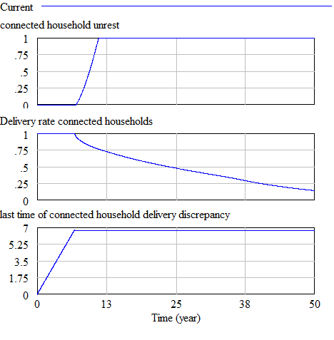
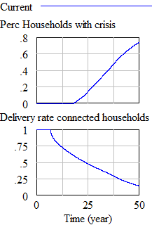
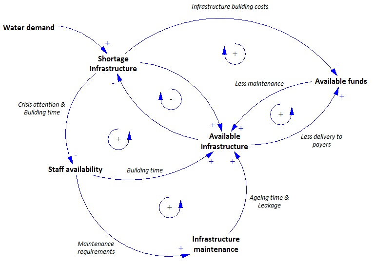
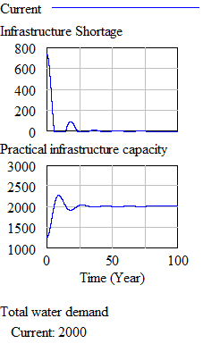
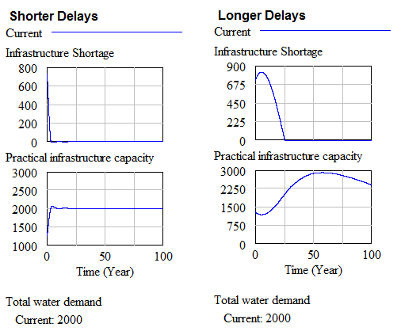
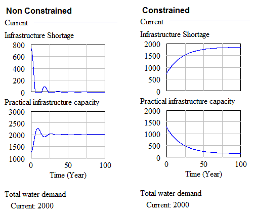

# System Overview

This document will describe the system elements and boundaries as identified in the Kirkwood water crisis system.

The following systems have been identified:

- Population System
- Infrastructure System
- Maintenance staff system
- Municipal funds system

There are several interfaces between these systems. These are:

- The maintenance of infrastructure is limited by maintenance staff availability and municipal funds availability. 
- The building of new infrastructure or restoring aged infrastructure is limited by maintenance staff and municipal funds availability.
- The need for new infrastructure is determined by the discrepancy between maximum infrastructure capacity and total population demand. 
- The productivity of the technical staff is influenced by their work pressure. 

# Experimental setup
The base unit of the model is in years. The system is observed over a period of 50 years, since this allows for several cycles of infrastructure ageing and rebuilding. As a solver method euler is chosen. Euler is chosen because there are several discrete changes in the system which runge-kutta can't solve. The time step needs to be ranging from 0.5 to 0.1 times the smallest time-constraint in the system. Currently in the model this is 1/10th of a year for planning to address discrepancies in infrastructure. Therefore the time-step of 0.015 is chosen.

# Maintenance staff system

# Municipal funds system

# Crisis system
The crisis system describes the two possible water crises which can occur in the Kirkwood area. 
The first water crisis is when there is general unrest or dissatisfaction regarding the delivery of water to residents or other urban water users. Since no information regarding this dissatisfaction was available we modelled it as follows:

Dissatisfaction depends on the delivery rate of water, and the period for which there was a delivery discrepancy. The delivery rate is defined as the portion of the water demand which can be met based on the infrastructure capacity. The unrest is then defined as the discrepancy rate times the time for which this discrepancy has been going on. The graphical output of this system is shown in figure 1.

The second water crisis which can occur is when there is a chance that the basic water limit for survival cannot be met. This water limit is set to a minimum of 10 liter / person / day. We assumed that water will not be distributed evenly among all households. Instead, we assume that when only 50% of total water demand can be met, already 10% of the households will be facing water shortages large enough for additional water supply through tankers to be necessary (see figure 2). Each tanker is assumed to require the attention of 1 staff member in order to distribute the water. 

# Population System

# Infrastructure System
The infrastructure system describes the commissioning, decommissioning and maintenance of the water supply system in the Kirkwood area.

## Assumptions
Several assumptions needed to be made due to gaps in the background reading. These assumptions are described in this section.

### Effect of maintenance on ageing time
In the background reading it was described that at 8% maintenance per year the average aging time of infrastructure is 30 years. We assumed that when there is 0% of the infrastructure is maintained per year, the average aging time will become 15 years. Having a higher maintenance coverage than 8% will not increase the lifespan of infrastructure.

### Effect of maintenance on leakage
In the background reading it was described that there is an average leakage of 30% due to bad maintenance. We assumed that if maintenance levels drop below the 8% indicated in the reading, leakages will rise to 50%. However, if infrastructure maintenance is increased the leakages will gradually drop to 0%.

### Effect of capacity pushing on ageing time
The background reading described that pushing the infrastructure can drastically decrease the lifespan of infrastructure. We assumed that at the maximum pushing of infrastructure of 30% the lifespan of infrastructure is decreased by 10 years.

### Required staff for constructing and planning infrastructure
Constructing new water infrastructure is mostly done by staff on a governmental level rather than staff on the municipal level. However, some supervision is still required by municipal staff. We assume that municipal staff is required for about 10% of the construction and planning activities. The rest is carried out by governmental staff which is out of scope of this model. Therefore, governmental staff is assumed to be always available.

## Validation
Three validation methods will be used:
- Theoretical direct structure test: Structure assessment
- Structure-oriented behaviour test: Extreme conditions
- Structure-oriented behaviour test: Behaviour reproduction & Surprise behaviour

### Structure assessment
The structure assessment test is a validation test which falls under the direct structure test category. This means the validation tests strictly focusses on validating the structure of the model and not the behaviour. Theoretical direct structure tests are validation tests which have to be done in the earlier steps of validating a model according to Barlas' sequence of steps of model validation (1996). 

The purpose of the structure assessment test is to check whether the model structure is consistent with relevant descriptive knowledge of the system (Sterman, ????). We have performed this test by drawing a causal diagram of the system as it was communicated to us and then checking this against how we modeled the relations in the actual model. Figure 2 shows the causal model of the Kirkwood water infrastructure system.

**Figure 2: Causal model**

### Behaviour reproduction & Surprise behaviour
When the system is not constrained by funds or staff constraints it is expected that the practical infrastructure capacity will meet the total water demand relatively easy and smooth in about 5 years (the infrastructure building time). Introducing a large step change in the water demand in the system will result in a large peak which will also be solved relatively smooth.

**Figure 3: Baseline system behaviour**

### Extreme conditions
When we drastically reduce the time required to build and plan infrastructure we expect the shortage to be  solved sooner than in our base case scenario. However, when we increase the planning times we expect that the shortage cannot be solved and instead remain on a constant level over time. Also, the oscillations around the target infrastructure capacity will be much lower when the delays arae smaller. This is shown in Figure 3. 

**Figure 4: Extreme value testing on  building times and water demand**

When performing extreme values testing on the variables constraining the building and maintaining of the infrastructure we expect to see that in the non restricted cases the infrastructure shortage gets solved smooth and easy. However, when heavily constrained we expect the shortage not to be solved and instead remain on a constant level over time. This is shown in figure 4.

**Figure 3: Extreme value analysis on constraining variables**

