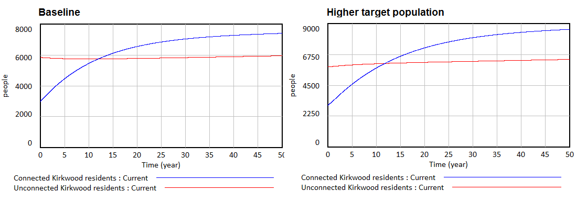
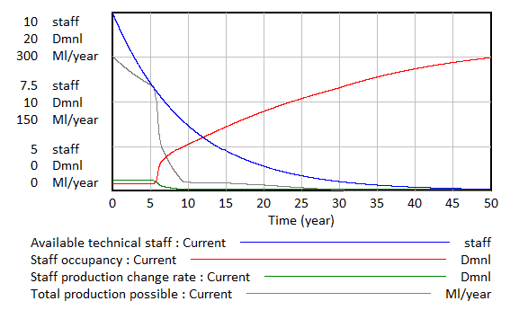
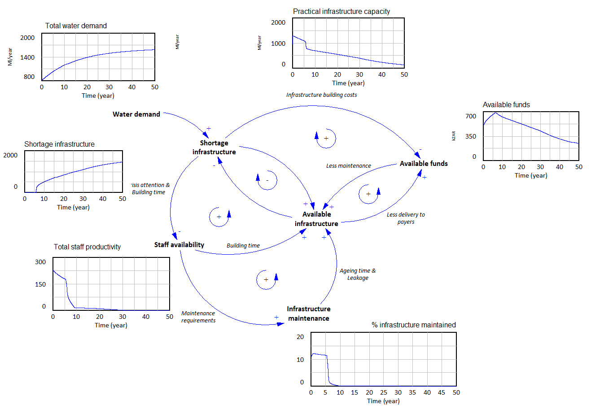

# System Overview

This document will describe the system elements and boundaries as identified in the Kirkwood water crisis system.

The following systems have been identified:

- Population System
- Infrastructure System
- Maintenance staff system
- Municipal funds system

There are several interfaces between these systems. These are:

- The maintenance of infrastructure is limited by maintenance staff availability and municipal funds availability. 
- The building of new infrastructure or restoring aged infrastructure is limited by maintenance staff and municipal funds availability.
- The need for new infrastructure is determined by the discrepancy between maximum infrastructure capacity and total population demand. 
- The productivity of the technical staff is influenced by their work pressure. 

# Experimental setup
The base unit of the model is in years. The system is observed over a period of 50 years, since this allows for several cycles of infrastructure ageing and rebuilding. As a solver method euler is chosen. Euler is chosen because there are several discrete changes in the system which runge-kutta can't solve. The time step needs to be ranging from 0.5 to 0.1 times the smallest time-constraint in the system. Currently in the model this is 1/10th of a year for planning to address discrepancies in infrastructure. Therefore the time-step of 0.015 is chosen.

# Maintenance staff system

# Municipal funds system

# Crisis system
The crisis system describes the two possible water crises which can occur in the Kirkwood area. 
The first water crisis is when there is general unrest or dissatisfaction regarding the delivery of water to residents or other urban water users. Since no information regarding this dissatisfaction was available we modelled it as follows:

Dissatisfaction depends on the delivery rate of water, and the period for which there was a delivery discrepancy. The delivery rate is defined as the portion of the water demand which can be met based on the infrastructure capacity. The unrest is then defined as the discrepancy rate times the time for which this discrepancy has been going on. The graphical output of this system is shown in figure 1.

**Figure 1: Water delivery dissatisfaction**

The second water crisis which can occur is when there is a chance that the basic water limit for survival cannot be met. This water limit is set to a minimum of 10 liter / person / day. We assumed that water will not be distributed evenly among all households. Instead, we assume that when only 50% of total water demand can be met, already 10% of the households will be facing water shortages large enough for additional water supply through tankers to be necessary (see figure 2). Each tanker is assumed to require the attention of 1 staff member in order to distribute the water. 

**Figure 2: Water supply crisis**

# Population System
The population system is mostly used as input for the rest of the model. Its main purpose is to determine the maximum water demand at a certain point in time. The information regarding the population system from the background literature proved insufficient to accurately model the behaviour as described during the lecture. The background reading described a system which would have exponential growth, while the lecture described constrained growth. 

In order to achieve the behaviour as described in the lecture two target population values for the unconnected and connected households in Kirkwood are added. Due to this addition it must be noted that the population system is not valid as a system which can be experimented on. It should only be used as an input for the rest of the model. 

# Infrastructure System
The infrastructure system describes the commissioning, decommissioning and maintenance of the water supply system in the Kirkwood area.

Several assumptions needed to be made due to gaps in the background reading. These assumptions are described in this section.

**Effect of maintenance on ageing time**
In the background reading it was described that at 8% maintenance per year the average aging time of infrastructure is 30 years. We assumed that when there is 0% of the infrastructure is maintained per year, the average aging time will become 15 years. Having a higher maintenance coverage than 8% will not increase the lifespan of infrastructure.

**Effect of maintenance on leakage**
In the background reading it was described that there is an average leakage of 30% due to bad maintenance. We assumed that if maintenance levels drop below the 8% indicated in the reading, leakages will rise to 50%. However, if infrastructure maintenance is increased the leakages will gradually drop to 0%.

**Effect of capacity pushing on ageing time**
The background reading described that pushing the infrastructure can drastically decrease the lifespan of infrastructure. We assumed that at the maximum pushing of infrastructure of 30% the lifespan of infrastructure is decreased by 10 years.

**Required staff for constructing and planning infrastructure**
Constructing new water infrastructure is mostly done by staff on a governmental level rather than staff on the municipal level. However, some supervision is still required by municipal staff. We assume that municipal staff is required for about 10% of the construction and planning activities. The rest is carried out by governmental staff which is out of scope of this model. Therefore, governmental staff is assumed to be always available.

# Validation
This section will go into detail on the validation of the various sub-models and the overall model. First, an overall structure assessment of the model will be performed without actually simulating behaviour. Then, the validity of the submodels will be described. Finally, an overall simulated validation of the entire model will be performed. 

## Structure assessment
The structure assessment test is a validation test which falls under the direct structure test category. This means the validation tests strictly focusses on validating the structure of the model and not the behaviour. Theoretical direct structure tests are validation tests which have to be done in the earlier steps of validating a model according to Barlas' sequence of steps of model validation (1996). 

The purpose of the structure assessment test is to check whether the model structure is consistent with relevant descriptive knowledge of the system (Sterman, ????). In order to perform this test a causal diagram (shown in figure x.) is made based on the main feedback loops identified from the background reading. This causal diagram was then checked against how the relations in the actual model. All feedback loops from the causal diagram were found implemented in the model. Therefore we consider the model to be structurally valid.

**Figure 2: Causal model**

## Infrastructure System Validation
The infrastructure system will be validated by performing behaviour reproduction, surprise behaviour and extreme conditions testing. 

### Behaviour reproduction & Surprise behaviour
When the system is not constrained by funds or staff constraints it is expected that the practical infrastructure capacity will meet the total water demand relatively easy and smooth in about 5 years (the infrastructure building time). Introducing a large step change in the water demand in the system will result in a large peak which will also be solved relatively smooth.

**Figure 3: Baseline system behaviour**

### Extreme conditions
When we drastically reduce the time required to build and plan infrastructure we expect the shortage to be  solved sooner than in our base case scenario. However, when we increase the planning times we expect that the shortage cannot be solved and instead remain on a constant level over time. Also, the oscillations around the target infrastructure capacity will be much lower when the delays arae smaller. This is shown in Figure 3. 

**Figure 4: Extreme value testing on  building times and water demand**

When performing extreme values testing on the variables constraining the building and maintaining of the infrastructure we expect to see that in the non restricted cases the infrastructure shortage gets solved smooth and easy. However, when heavily constrained we expect the shortage not to be solved and instead remain on a constant level over time. This is shown in figure 4.

**Figure 3: Extreme value analysis on constraining variables**

## Population system validation
Since the population system is used mostly as input to the model it is mostly important that it represents the actual population growth in Kirkwood relatively well and that it allows for experimentation with different growth scenarios. The actual behaviour of the population in Kirkwood was described to us as starting at around 3000 connected and 6000 unconnected residents. The connected kirkwood residents shows a limited growth stabilising at about 6000-8000 residents. The unconnected household show a small decline but stabilise at around 6000 residents. As figure x. shows, the population system replicates this behaviour rather well. Also, adjusting the target population values shows a similar behaviour, but with larger stabilising values.

**Figure 3: Population system behaviour**

## Staff system validation
The staff system is expected to show a constrained decrease in available staff members due to the average staff service time being 10 years while only 1 staff member is hired every 2 years. The number of staff members will decrease to 5 over time.

Due to this decrease in staff members, the staff occupancy will rise given a stable water demand and infrastructure. Because of this increase in occupancy the maximum possible production for the staff members will plummet due to stress and tiredness. 

**Figure 3: Population system behaviour**

## Funding system validation

## Coupled model validation
In this section a simulated run of the model will be used to determine the overall validity of the system. 

We see that initially there is no infrastructure shortage. This is correct since the initial infrastructure capacity is higher than the total water demand by the initial population. This also means that the staff productivity is high since they are not overworked.

However, as the total water demand increases and the infrastructure ages, a sharp increase in the infrastructure shortage occurs. When this water infrastructure shortage is combined with the gradual decrease of staff members, the remaining staff members get heavily overworked. This will drop their productivity leading to decreased construction and maintenance of infrastructure. Due to the decreased maintenance, the infrastructure will start aging faster and leaking more, resulting in even larger infrastructure shortages. 

Initially, funding of the system goes okay but as less people get water, the billable decrease, therefore decreasing the total available funds. 

**Figure x: Total system behaviour**
